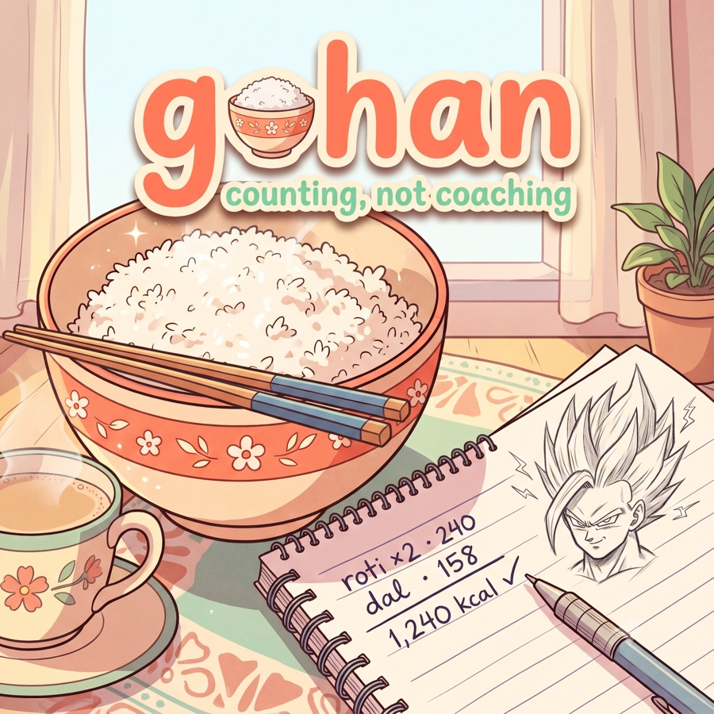
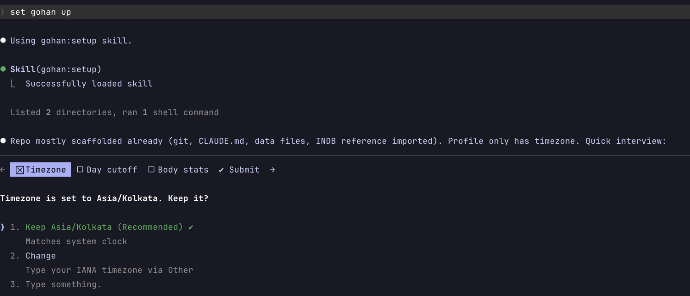

<p align="center">
  
</p>

<p align="center">
  A calorie tracker that lives in your terminal.<br>
  <b>Claude Code is the app; a private git repo you own is the database.</b>
</p>

```
> log: 2 rotis and a katori of dal

Logged to 2026-07-04 · lunch
  roti ×2 · 80 g (your roti, calibrated) · 240 kcal
  dal · 150 g (your katori) · 158 kcal
Day so far: 1,240 kcal · 52 g protein · on-plan
```

No server, no account, no subscription. You say what you ate (or paste a photo), the agent resolves it against real nutrition data, writes a JSON file into your repo, and commits it. In fifty years, when every app in this story is dead, your food history is still dated JSON files you can open in anything.

## The problem

Mainstream calorie trackers fail in the same three ways:

1. **The essentials are paywalled.** Photo logging, macro breakdowns, and exporting your own data all sit behind a subscription.
2. **Non-Western food data is garbage.** The same roti ranges from 70 to 150 kcal across crowd-sourced duplicate entries. If you eat dal, sabzi, or anything your grandmother would recognize, the numbers are noise.
3. **Your history is hostage.** Years of logs live in someone else's cloud, readable only through their app, gone when they pivot or fold.

And underneath all three: logging through search-a-database-and-pick-from-a-dropdown is enough friction that most people quit within weeks.

## What gohan does instead

- **Natural language is the interface.** "2 rotis and a katori of dal" needs no form and no barcode. An LLM is the best food parser ever built; gohan just points it at grounded data.
- **Your data, your repo.** Each user runs their own private copy. Nothing is hosted, shared, or metered. `git log` is your audit trail.
- **Every number is traceable.** Each logged item keeps your words verbatim, the resolved food, how the grams were derived, the nutrition source, and a confidence flag. When gohan estimates, it says so.
- **Counting, not coaching.** gohan records and reports. What you *should* eat is between you and your dietician. gohan gives you honest numbers to bring to that conversation.


## Install

You need [Claude Code](https://claude.com/claude-code) and [bun](https://bun.sh). The repo doubles as its own plugin marketplace:

```
/plugin marketplace add shiroyasha9/gohan
/plugin install gohan@gohan
```

Then make an empty directory for your food history, open Claude Code in it, and say:

```
set me up
```



The setup skill interviews you (timezone, day boundary, optional stats), scaffolds your private data repo, walks you through creating a **private** remote, and offers two optional imports:

- **Indian food data**: downloads and converts the [INDB](https://www.anuvaad.org.in/) dataset (~1,000 Indian recipes) locally on your machine. Not eating Indian food? Skip it.
- **USDA lookups**: a free [FDC API key](https://fdc.nal.usda.gov/api-key-signup.html) covers everything else.

Updating later is `/plugin update gohan`. Your data repo is never touched.

> [!IMPORTANT]
> Your data repo is personal health data. Keep it private. Setup will never offer to create a public remote, and neither should you.

## Daily use

You talk; skills route:

| You say                                 | What happens                                              |
| --------------------------------------- | --------------------------------------------------------- |
| `log: 2 rotis and dal` / a meal photo   | `log-meal` writes today's day-file, commits, shows totals |
| `weight: 81.4` / `gym: legs, 60min`     | `log-body` records weight, workouts, treatment notes      |
| `summary` / `how was this week`         | `summarize` shows totals, adherence %, weight trend       |
| `my katori weighs 150g`                 | `calibrate` maps that unit to real grams, permanently     |
| share a photo of your diet plan         | `import-diet-chart` versions it as data                   |
| (a new food shows up)                   | `resolve-food` finds grounded numbers, caches them        |
| (a cached food gets corrected)          | `recompute` silently fixes every affected past day        |

Every write ends with a commit and push, so phone and laptop sessions never diverge.

## How your data looks

```
data/
├── days/2026/07/2026-07-04.json   one file per day: meals, weight, workouts
├── foods.json                     personal food cache, per-100g, source-flagged
├── measures.json                  your utensils, weighed once ("my katori = 150 g")
├── diet-chart/                    optional: your nutritionist's plan, versioned
└── profile.json                   timezone, day boundary, stats
```

Each food is resolved once (nutrition database first, then the USDA API, then a clearly flagged estimate) and becomes canon for every repeat log. Trends stay meaningful even when an absolute value is somewhat off, because the same dal is always the same dal.

A logged item is a full resolution trail:

```json
{
  "input": "1 katori dal",
  "food": "dal (home)",
  "qty": { "amount": 1, "unit": "katori", "grams": 150, "basis": "measures" },
  "nutrients": { "kcal": 158, "protein": 9, "carbs": 21, "fat": 4, "fiber": 6 },
  "source": "indb:DAL_TADKA",
  "confidence": "high"
}
```

## Conventions worth knowing

- **Wake-day**: entries before your configured cutoff (default 04:00) count toward the previous day. A midnight snack belongs to the day you were awake for.
- **Confidence per item**: `high` means a cached food with weighed or calibrated grams, `medium` means estimated grams, `low` means an estimated food.
- **Burn is display-only**: workout calories are tracked for consistency, but they are never netted against intake. Fictional burn numbers don't get to justify extra eating.
- **Adherence is derived, not invented**: with a diet chart imported, every meal gets an `on-plan` / `variation` / `cheat` label, and summaries compare intake against *your nutritionist's* targets rather than numbers gohan made up.

## Development

This repo is the dev workspace; `plugin/` is what ships (skills, prebuilt bun bundles, schemas copy, session hook). After changing `apps/scripts` or `packages/core`, run `bun run build:plugin` and commit the regenerated bundles. CI fails on drift.

Dev loop: `claude --plugin-dir ./plugin` from a scratch data directory, `/reload-plugins` after edits. Quality gates: `bun test`, `bun run typecheck`, `bun run check`. `packages/core/src/schemas.ts` is the single source of truth for every data shape; design docs live in `specs/`.

## License

MIT
